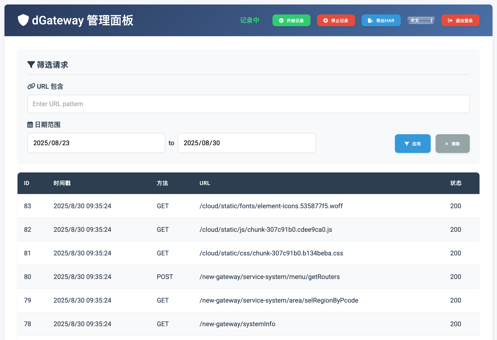
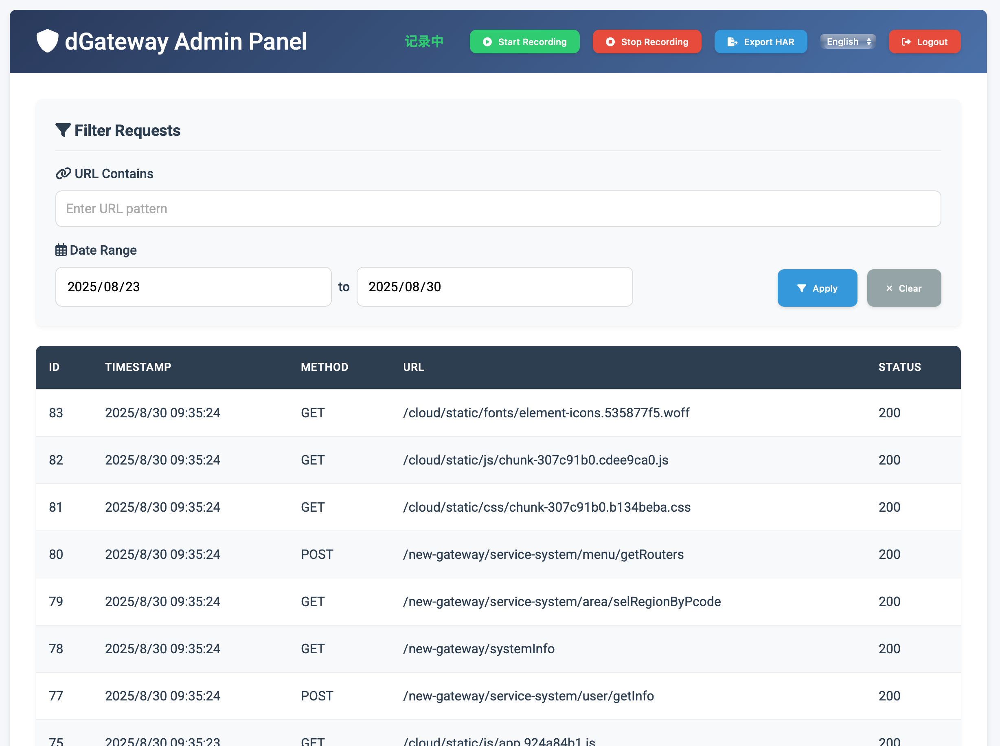
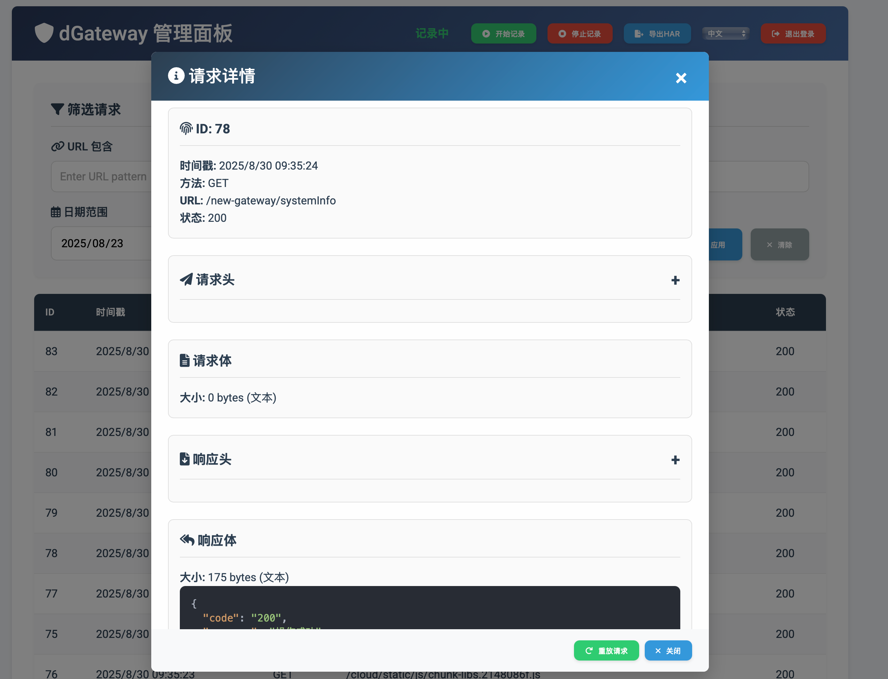
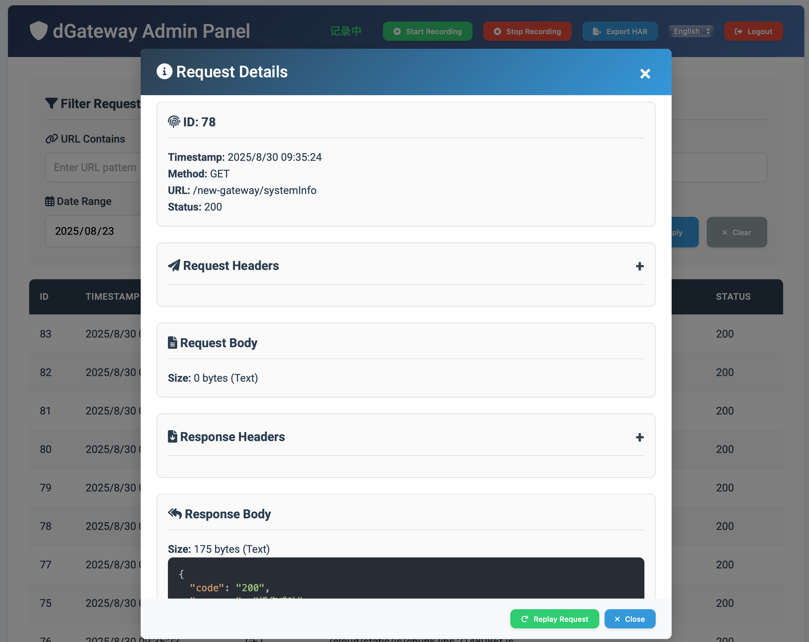
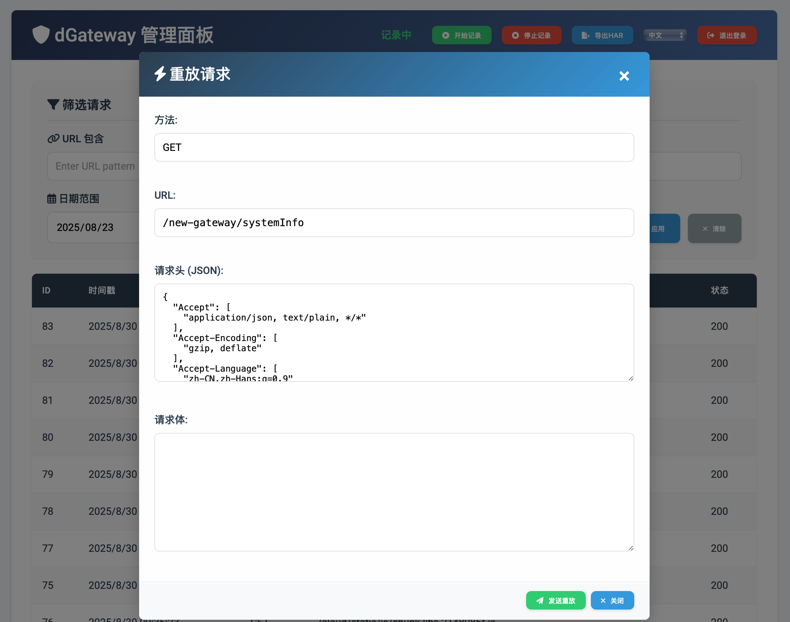
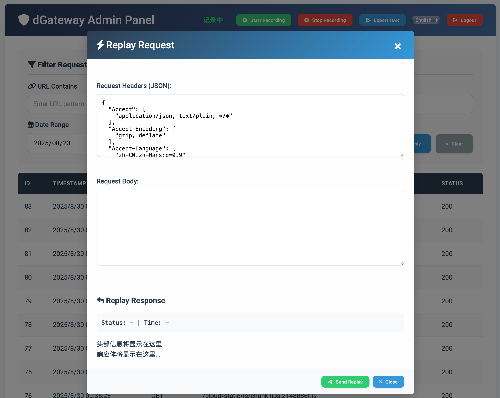
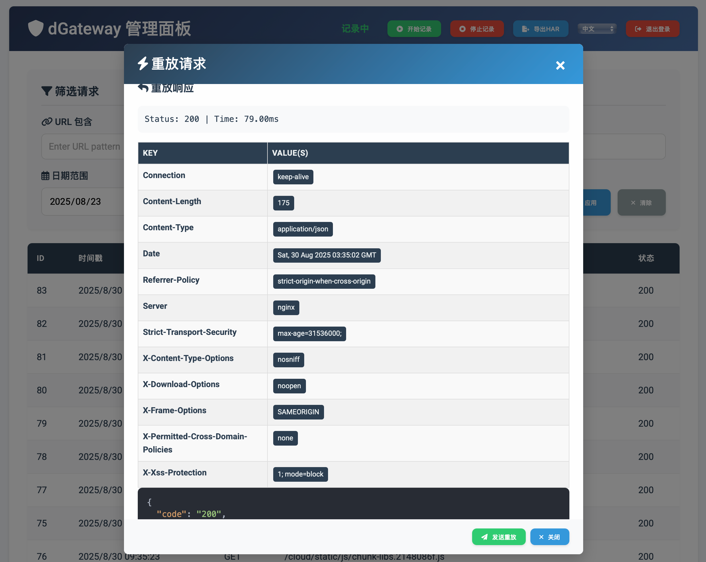
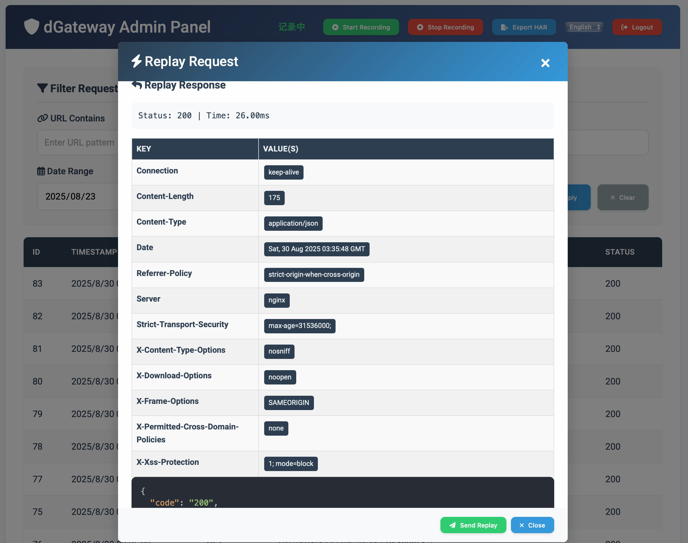

# 截图文件说明 (Screenshots README)

本目录 (`assets`) 包含了项目相关的截图。

## 图片列表 (Image List)

1.  **主界面 (Main Interface)**
    *   中文: 
    *   English: 

2.  **请求详情 (Request Detail)**
    *   中文: 
    *   English: 

3.  **重放请求 (Replay Request)**
    *   中文: 
    *   English: 

4.  **登录界面 (Login Interface)**
    *   中文: 
    *   English: 
